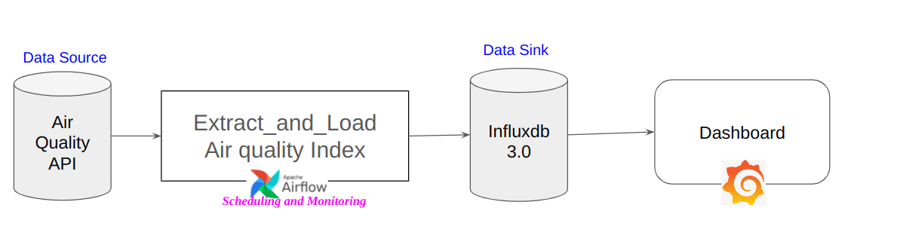

# A. Diagram of the pipeline


# B. Installation of the project
## Clone repository and set Make the necessary settings for Airflow

```
git clone https://github.com/turguttaha/Demo_Data_Pipeline.git

mkdir -p ./dags ./logs ./plugins
echo -e "AIRFLOW_UID=$(id -u)" > .env
```

## To run docker compose file
### Before run you need to be sure that you have docker image of https://github.com/turguttaha/Demo_Data_Pipeline.git
### Check readme.md file step (D. Creating docker image) -> https://github.com/turguttaha/Demo_Data_Pipeline/blob/main/Readme.md
```
docker compose up airflow-init

docker compose up -d
```

## Access to components:
### AIRFLOW
```
url: http://localhost:8080/
username: airflow
password: airflow
```
### GRAFANA
```
url: http://localhost:3000/
username: admin
password: admin
```
### INFLUXDB
```
url: http://localhost:8086/
username: ADMIN_USERNAME
password: ADMIN_PASSWORD
```

## Create ".env" file in the dags folder of project.
### !!! Without .env file you can not run your dag task.
### You can get api key from https://docs.openaq.org/docs/getting-started
### You can get your influxdb token from: http://localhost:8086/orgs/d1d7ff3ddf572196/new-user-setup/python
```
api_key=<api key of the Air quality API>
INFLUXDB_TOKEN=<your influxdb token>
INFLUXDB_ORG=ORG_NAME
INFLUXDB_URL=http://influxdb2:8086
REFRESH_RATE=1
REFRESH_DAY=12
```

# C. Before contributing project
```
python -m pip install --upgrade pip
pip install pre-commit
pre-commit install
```

# D. More information about airflow
## Running Airflow in Docker
https://airflow.apache.org/docs/apache-airflow/2.5.2/howto/docker-compose/index.html
## Use Apache Kafka with Apache Airflow
https://docs.astronomer.io/learn/airflow-kafka#step-6-run-the-dags
